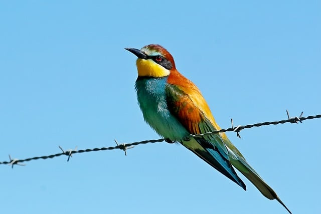
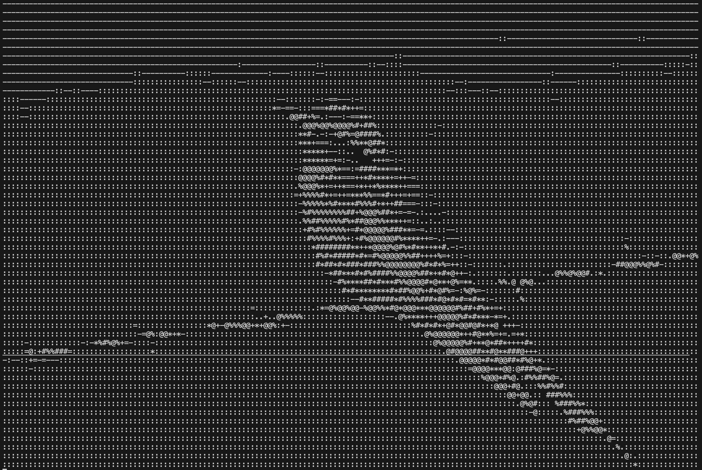
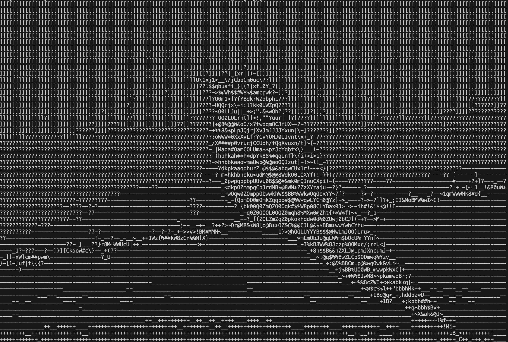

# **ASCII picture translator**
イメージ → ASCII 変換アプリケーション


# 概要
- **ASCII art 生成アプリケーション**
- ASCII art (アスキーアート)とは、プレーンテキストによる視覚的表現技法のことである。
- pixelで構成されているイメージの各ピクセルを文字に置き換えることで画像を表現する。
- 文字はその形が占める領域の広さ(密度)によって、視覚的に明暗が分かれることを利用し、各pixelの明るさに対応する文字へと置き換えた。

### モチベーション(Motivation)
- AIを用いた画像生成やフィルターが溢れていて、自分自身の画像フィルターを作ってみたかった。
- そのフィルターとして最もレトロな **ASCII art** にした。


## Demo / デモ操作
- Source image ([pixabay](https://pixabay.com/ja/)上の[著者権フリー画像である](https://pixabay.com/photos/european-bee-eater-bird-plumage-10145644/))

- ASCII simple ver

- ASCII complicated ver



## 特徴
- 結果物サイズ調整 : ユーザー好みで結果物のサイズ調整可能
```
const int wanted_max_width_pixel_size
```

- ASCII複雑度調整 : 基本明暗分別10段階から70段階に調整可能
```
const std::string ascii
```


## インストール ・ セットアップ
```bash
git clone https://github.com/dngmin/ASCII-picture-translator.git
cd ASCII-picture-translator
mkdir build && cd build
cmake ..
make
```

## 使用方法
```bash
./ASCII-picture-translator "image path"
```

## 使用技術
- 言語: C++
- ライブラリ: OpenCV
- ビルド: Cmake


## 今後の課題
- 動画をASCIIで再生する機能